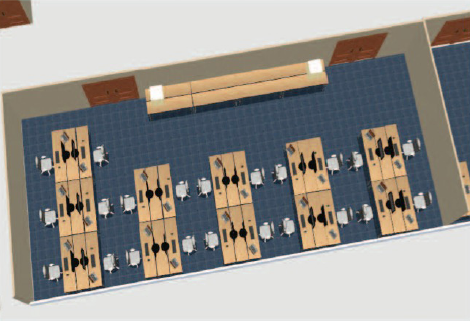

# Conference IT Needs: Review Discussion Feedback from IT Setup Staff

*Contributors: Raphael, Volker, Ivan, Stefano, Johan*  
*Page contact: Raphael Mueller (GSI Helmholtzzentrum für Schwerionenforschung GmbH)*  
*Last update: November 8, 2019*

---

This page (or presentation) should help to get you on track what to look out for when it comes to conference IT.

## Why Should IT Be Near Perfect?

IT plays a crucial role in conference success because it:

- **Foundation of the conference** - Forms the basic infrastructure everything else depends on
- **Enables editors to work** - The better the IT, the more efficient editors become, directly impacting proceedings quality
- **Major budget component** - Represents a significant portion of conference expenses
- **Drives perception** - One of the key factors influencing attendees' perception of conference success

## Networking

### Understanding Venue Capabilities

A conference venue's networking capability and limitations need to be clearly understood:

- **Clear communication** - Communicate expectations clearly, agree upon them and put the guarantees in writing (e.g., Service-level-agreement in contract)
- **Investigation** - Investigate their system and do not simply believe their claims
- **Assessment** - Assess what level of service they can or cannot offer
- **Network design** - Design your network so conference mission-critical networks (e.g., proceedings office, presentation management) cannot be impacted by convenience networks (e.g., internet cafe, public WiFi)
- **Network separation** - Use separate networks managed through VLANs

### Wired Network Requirements

Network infrastructure at a conference site **MUST** comfortably allow for the required bandwidth.

**Key components to evaluate:**

| Network Component | Minimum Requirement | Recommended |
|-------------------|---------------------|-------------|
| Local Area Network (LAN) | 100 Mbps | 1000 Mbps |
| Network Backbone | 100 Mbps | 1000 Mbps |
| Internet Connection | 10 Mbps | 40+ Mbps |

**Additional considerations:**
- Ensure sufficient routing capacity for the number of connections
- Prepare backup/failover solutions:
  - Second ISP
  - 3G router for minimum internet access to proceedings office
  - Thumb drives for critical file transfers

### Wireless Network Planning

Remember that most participants, exhibitors, and editors have multiple devices.

**Address weaknesses in advance:**
- Add additional access points where needed
- Deploy portable access points for flexibility
- Consider third-party wireless companies for worst-case scenarios
- Use reliable, enterprise-grade wireless devices

## Hardware

Hardware requirements are dynamic. Current recommendations are maintained on the [JACoW hardware page](https://www.jacow.org/Editors/RecommendedHardware).

### Typical Hardware Distribution by Area

| Area | Equipment Needed |
|------|------------------|
| **Proceedings Office** | 10-20 computers, 1-2 printers |
| **Author Reception** | Internet cafe setup with 10-20 computers, laptop spaces |
| **Business Office** | 2-5 computers, 1 multi-function printer |
| **Presentation Management/Speaker Preparation** | PC and Mac support identical to auditorium setup, 2-4 Windows laptops, 1 Mac laptop |
| **Auditorium(s)** | 1 PC and Mac support per auditorium, 1 spare of each on-hand, 1 timer per auditorium |
| **Registration** | As needed for registration activities |
| **Satellite Meetings** | Laptop and projector as needed |
| **Dot Board** | Laptop and large screen, typically 1-3 setups |

**Important note:** Computer setup should be identical to the auditorium to avoid surprises (software, screen resolution, etc.)

## Software

Since software requirements change frequently, consult the [Recommended Software List](./jacow-recommended-software.md) on the JACoW site.

### Additional Resources

- **Detailed coverage:** [Software Tools and Requirements, Setup and Installation Options](./jacow-software-tools-setup.md)
- **Setup assistance:** [JACoW Software Bundle](./jacow-software-bundle.md) - previously successful but maintenance status uncertain due to Acrobat responsibility changes
- **License information:** [JACoW Software Licenses](./jacow-additional-resources.md#jacow-software-licenses) - access requires chair approval

### Setup Strategy

- **Large conferences:** Set up a "master" computer and clone other systems
- **Small conferences (4-6 PCs):** Manual setup may be more practical than cloning overhead

## Web and File Server Considerations

### Server Load Patterns

- **Pre-conference:** Final month is the busiest time for web and file servers
- **During conference:** Continuous downloading and uploading of papers and source files
- **Critical requirement:** Reliable connectivity to web and file servers from venue is mission-critical

### Traffic Analysis Example (NA-Pac'11)

- Server traffic remains flat until ~1 week before deadline
- Peak traffic reached ~250 files/hour on paper upload deadline  
- Bandwidth usage comparable during conference editing
- Occasional uploads during post-conference processing

## Space Planning

### General Principles

- Create layouts for all IT spaces using tools like Sweet Home 3D (free interior design application)
- Design spaces to provide ample room for editors with ergonomic considerations
- Refer to detailed layout talks mentioned in references for additional information

### Space-Specific Considerations

#### Proceedings Office

#### Speaker Preparation

#### Author Reception  

#### Author Reception  

## Ergonomics

See detailed guide: [Setting up the Proceedings Office: Ergonomics and Logistics](./jacow-additional-resources.md#setting-up-the-proceedings-office-ergonomics-and-logistics)

### Workspace Requirements

**Desks and workspace:**
- Deep and wide enough for working with printed papers
- Sufficient space for laptops and additional equipment
- Extra chairs and space for visiting authors

**Seating:**
- Ergonomic, height-adjustable chairs
- Comfortable for 8-12 hour daily use for up to 10 days

**Lighting:**
- Bright workspaces for reading papers
- Full spectrum lighting when possible
- Natural light from windows preferred

## Procurement: Buying vs. Renting

### Case Studies

**IPAC'15 (large conference, 20+ editors) - Purchasing:**
- ✅ Worked very well
- ✅ Excellent hardware choice
- ✅ Plenty of configuration time
- ✅ Spares readily available
- ❌ Monitor and power cord shortages

**IPAC'16 (large conference, 20+ editors) - Rental company:**
- ✅ Significant labor savings
- ✅ Complete setup including power, network, updates
- ❌ Higher cost

**IBIC'16 (medium conference, 6 editors) - Rental:**
- ✅ Worked fine overall
- ✅ IT setup faster than expected
- ✅ Software bundle installation straightforward
- ✅ Parallel setup with multiple people made process smooth

## Infrastructure Decisions

### Wired vs. Wireless

**Recommendation:** Use wired networks for proceedings office and conference-critical systems.

**Reasoning:**
- Venue wireless often inadequate for user volume
- Wired connections more stable and reliable
- Wireless interface susceptible to interference

**Wireless considerations:**
- Individual editors can work on WiFi successfully
- Mature and stable when properly configured
- Can reduce costs and installation time
- Requires careful planning (separate networks, dedicated access points)
- Consider potential interference sources

### Software Updates

**Common oversight:** Not all updates are applied to systems, particularly:
- Windows updates
- Software updates (especially Microsoft products like MS Office)

**Solution:** Properly configure Windows Update options on master computer before cloning.

## Advice for Future Conference Planners

### Time Management
- **Don't expect regular work productivity** starting one month before conference
- **Expect expanded scope** - you'll investigate and handle much more than just IT

### Learning and Preparation
- **Learn from past conferences** - study lessons learned documentation
- **Send people to conferences** - attend as many conferences as possible for experience
- **Train speaker managers** - send at least one person to gain speaker preparation experience

### Flexibility and Planning
- **Stay flexible** - each conference has unique requirements
- **Draft experienced people early** - you cannot handle everything alone
- **Bring extra supplies:**
  - Power strips
  - Extension cords  
  - Monitors
- **Stock up on sleep** before the conference
- **Plan extensive venue networking discussions** beforehand

### Staffing
- Having experienced people in Speaker Preparation ensures smooth operations
- Recruit intelligent, dedicated people as early as possible
- Bring as many qualified staff as budget allows

---

## References

**This page is based on talks providing detailed information (reading recommended):**

For further information and detailed presentations covering these topics, consult the JACoW conference proceedings and training materials.

---

