# Adobe Acrobat DC Pro Configuration

## 0. Copy the Dotting Script to the correct Location

Place Dotting Script into the Acrobat JavaScript directory. Note that the directory will be named the same as the version of acrobat you are using and may vary among different operating systems. For the latest Acrobat DC on Windows it should be:

    C:\Program Files\Adobe\Acrobat DC\Acrobat\Javascripts

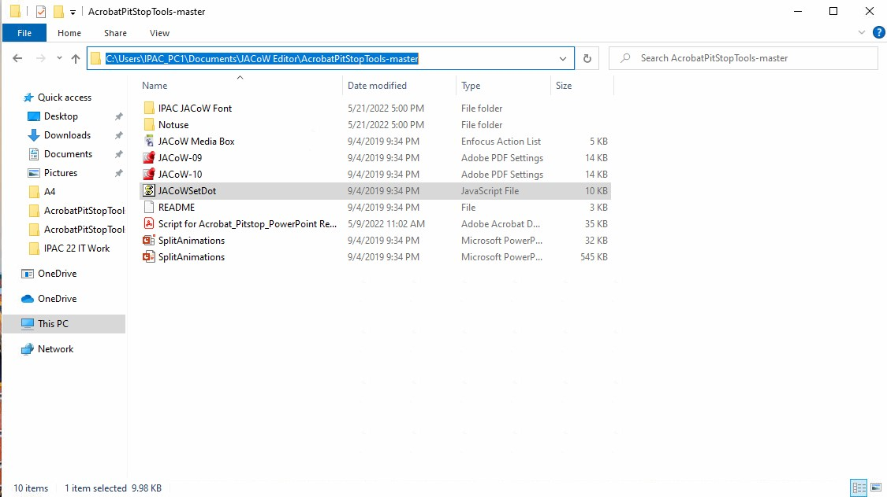

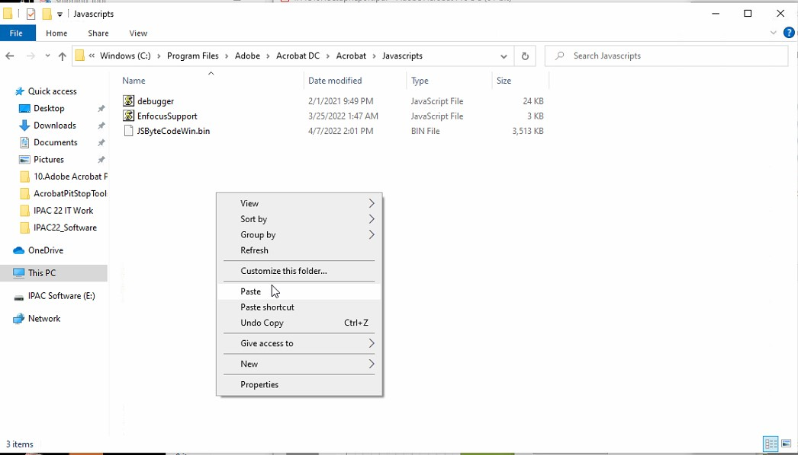

## 1. Revert to classic interface

If you have a recent version of Acrobat DC you'll also get the new user interface, which is somehow disorienting and slower for our task. To revert to the classic Acrobat interface, open Acrobat Pro, select the hamburger menu   and choose `Disable the new Acrobat`.

## 2. Update Acrobat

Open the `Help` menu and select `Check for updates`. Apply updates if needed and restart Acrobat.

## 3. Access Preferences Menu

`Edit` > `Preferences` > `General...` or use the `Ctrl` + `K` shortcut to access the Preference Menu.

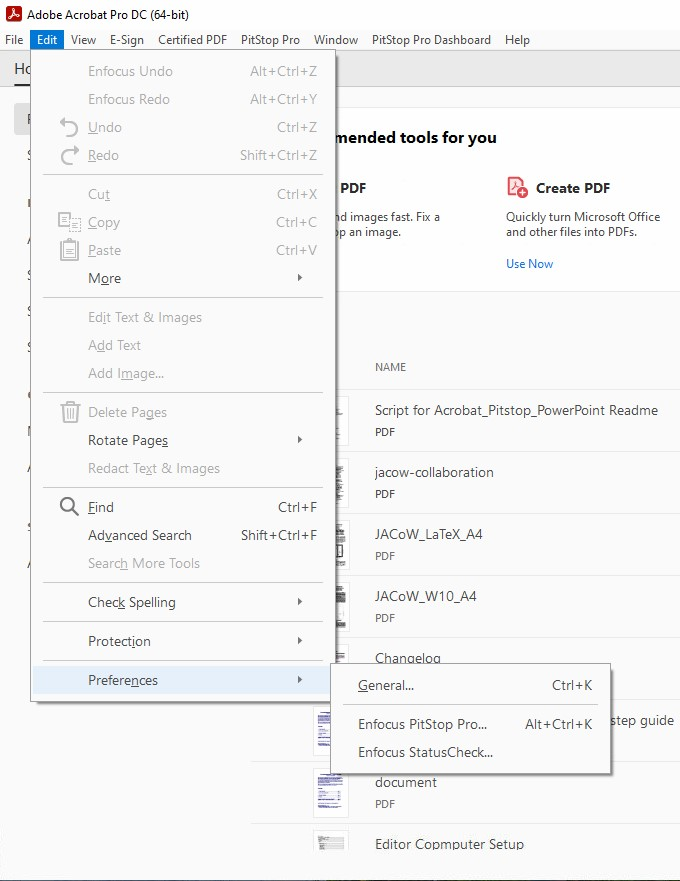

## 4. General settings

Stop Acrobat from generating URLs links in distilled papers. *(Uncheck “Create links from URLs”)*:

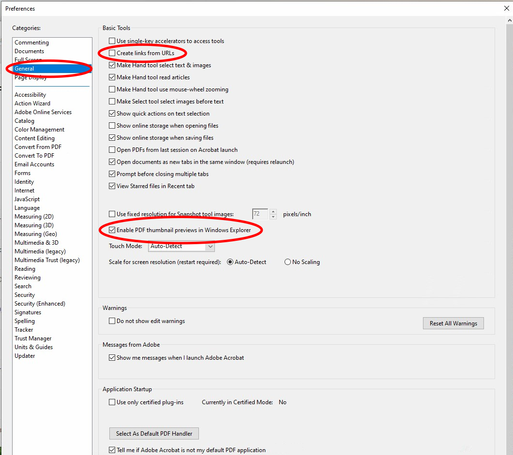

## 5. Page display

Display fonts using the fonts in the PDF not local fonts. *(Uncheck “Use local fonts”)*:

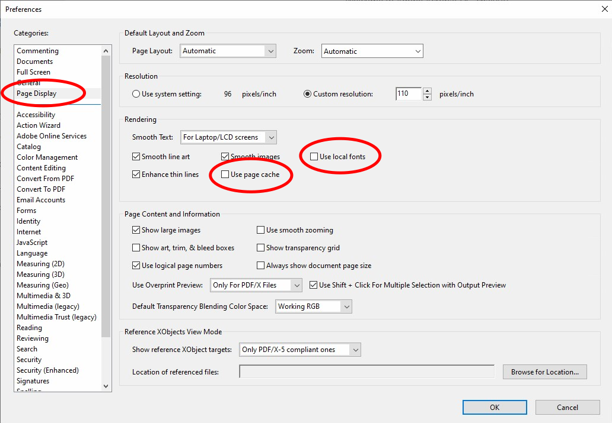

## 6. Content Editing

Make sure Adobe Acrobat displays this as they are. *(Uncheck “Enable Artificial Bold/Italic Styles”)*:

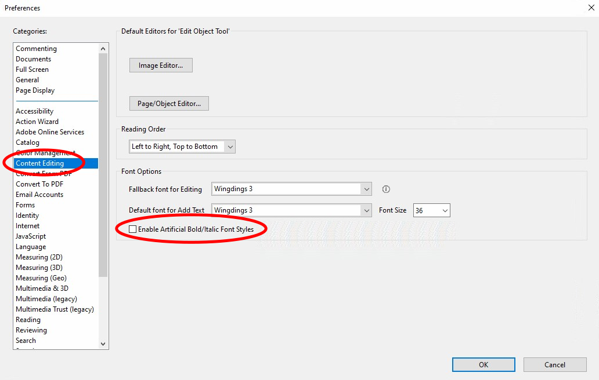

While editing if you accidentally type changing text in the PDF you may not notice, by setting the editing text and add text to Wingdings 36 font size it will be obvious immediately:

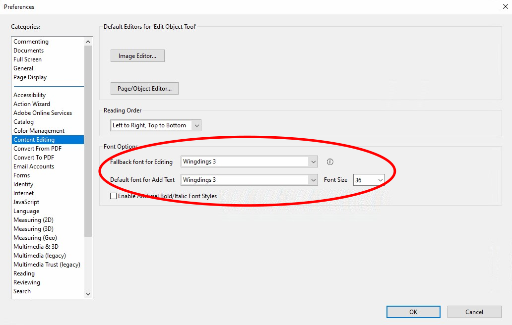

## 7. Convert From PDF

Include all fonts during embedding. In the `Encapsulated PostScript` drop down menu `Font inclusion` > `Embedded and Referenced Fonts`, Uncheck `Convert TrueType to Type 1`:

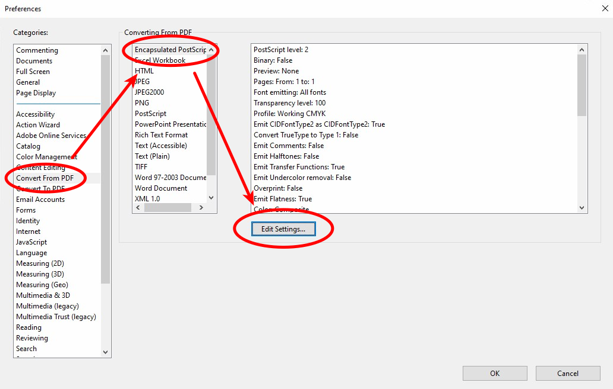

Setup the `PostScript/EPS` settings to use the `JACoW.joboptions` **Note**: Before do this step must be setup the Adobe Acrobat Distiller DC first.

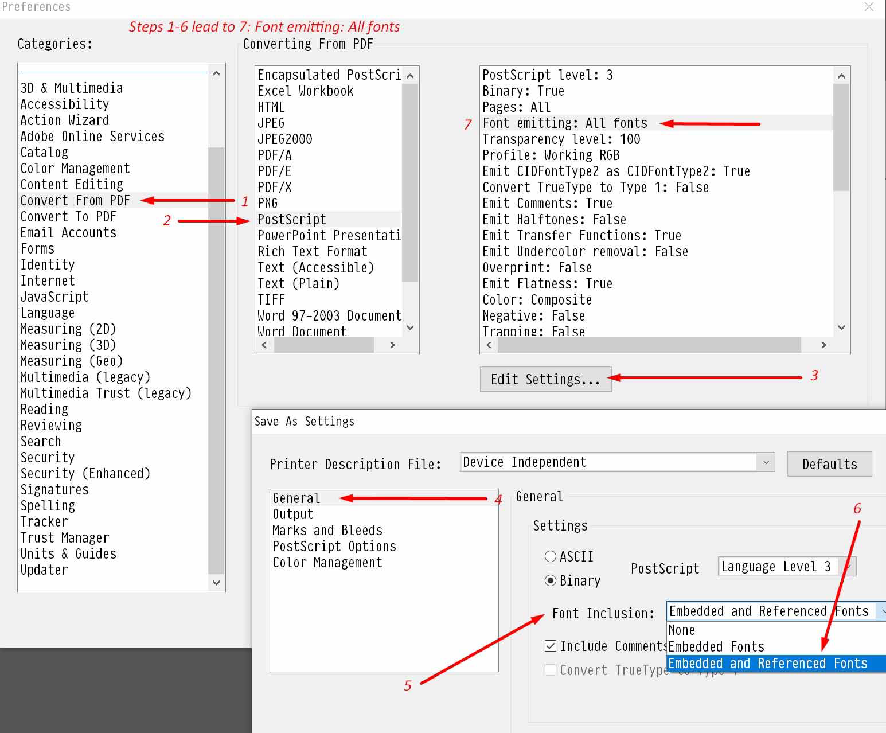

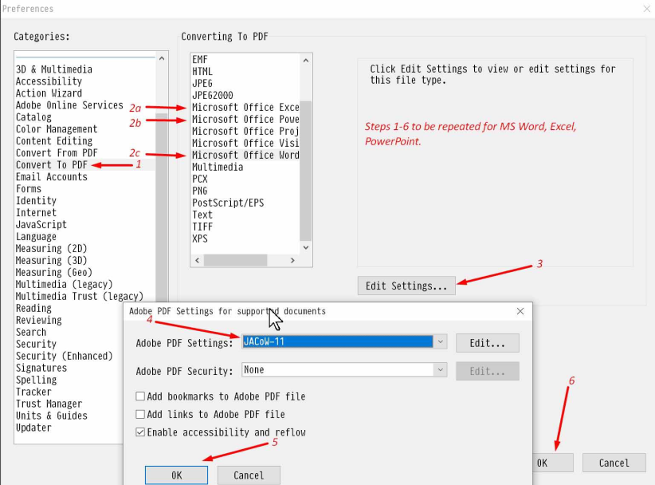

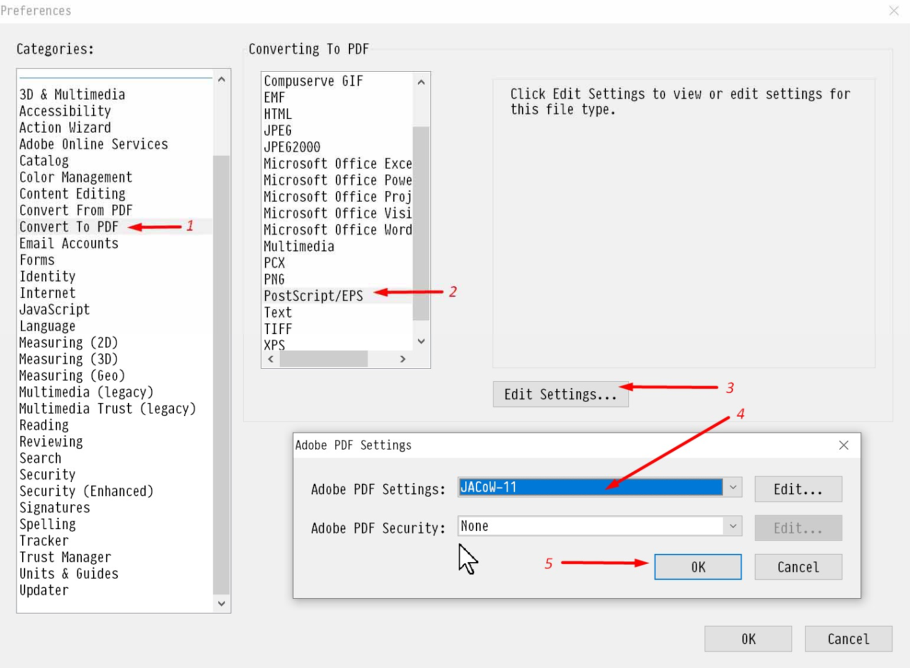

## 8. Convert to PDF

Setup the PNG Grayscale and Color to High Quality:

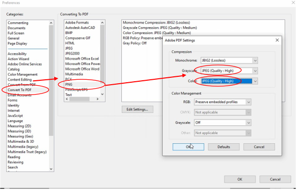

## 8. Identity

Place **your name** in the identity `Name` field which will be printed on the top of the page when you print a dotted paper:

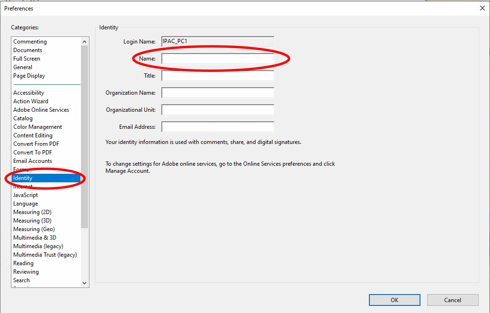

## 10. JavaScript

`JavaScript` > `JavaScript Security` > Check `Enable menu items JavaScript execution privileges`.

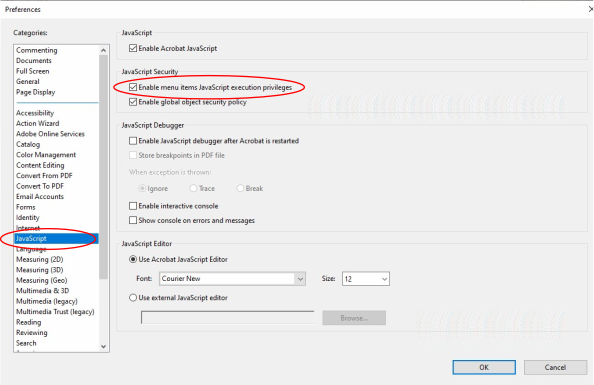

## 11. Search

Configure the Acrobat search tool. 

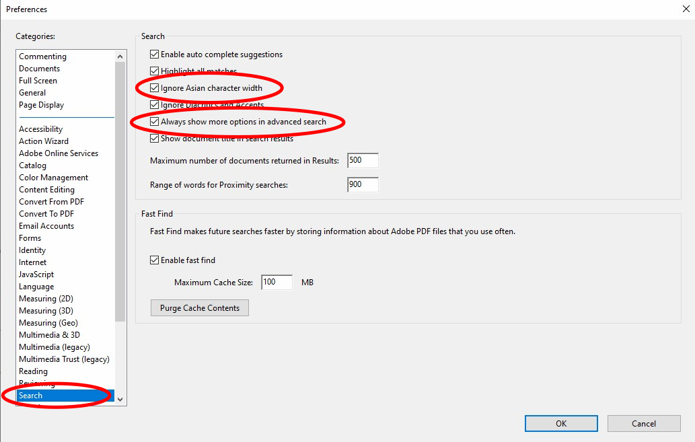

## 12. Units and Guides

Setup the **grid lines** which will show you the margin rules on the page. These are turned on and off using `Ctrl` + `U`:

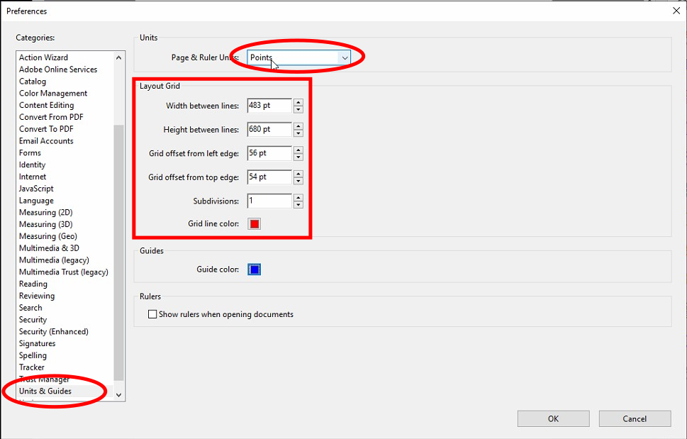

## 13 Full Screen

Configure the Full Screen to loop through pages:

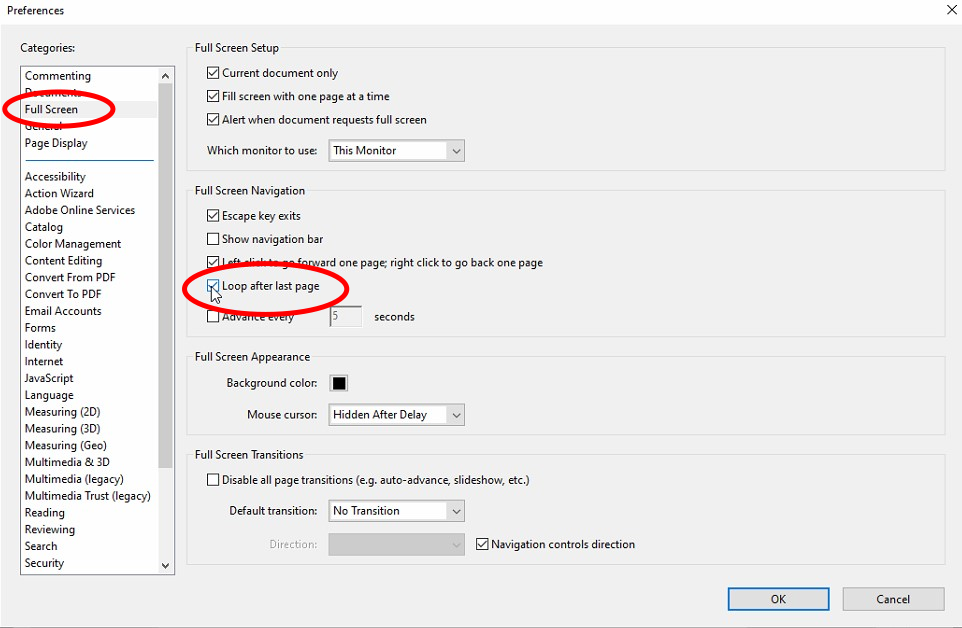
