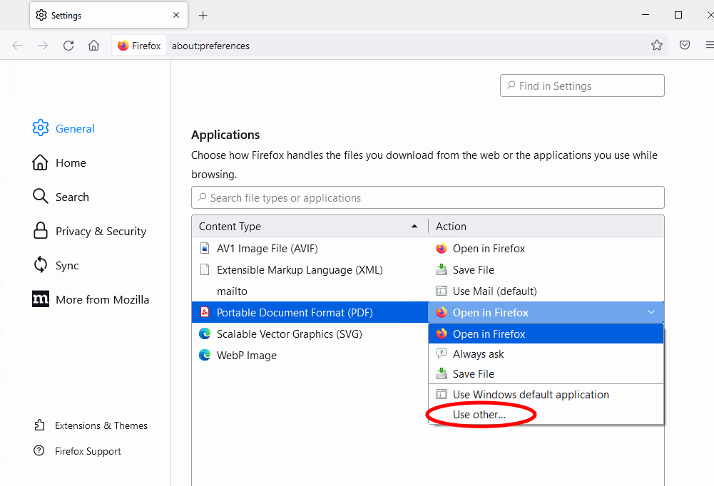

# Mozilla Firefox

## Default browser && plugins

1. Set Firefox as default browser

2. Check for updates and install if needed. Restart to apply them.

3. Install the following plug-ins:
   
     1. [Foxy gestures](https://addons.mozilla.org/en-US/firefox/addon/foxy-gestures/)
   
     2. [uBlock origin](https://addons.mozilla.org/en-US/firefox/addon/ublock-origin/)

4. Set your special IPAC instructions page as Firefox's homepage (e.g.: [IPAC'25](https://ipac-docs.jacow.org/PaperEditing/IPACs/IPAC25/)'s).

## Set Acrobat as default PDF application

You should set Acrobat as the PDF viewer to handle PDF files in FF. To switch from from the built-in PDF viewer: 

1. Click the hamburger menu and select `Settings`. 
2. In the `General` panel, go down to the `Applications` section. 
3. Find `Portable Document Format (PDF)` in the list and click on the entry to select it. 
4. Click on the arrow under the `Action` column for the above entry and select the `User other...` from the drop-down menu.
5. Select Adobe Acrobat and confirm.

