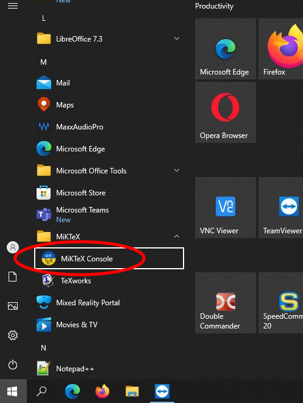
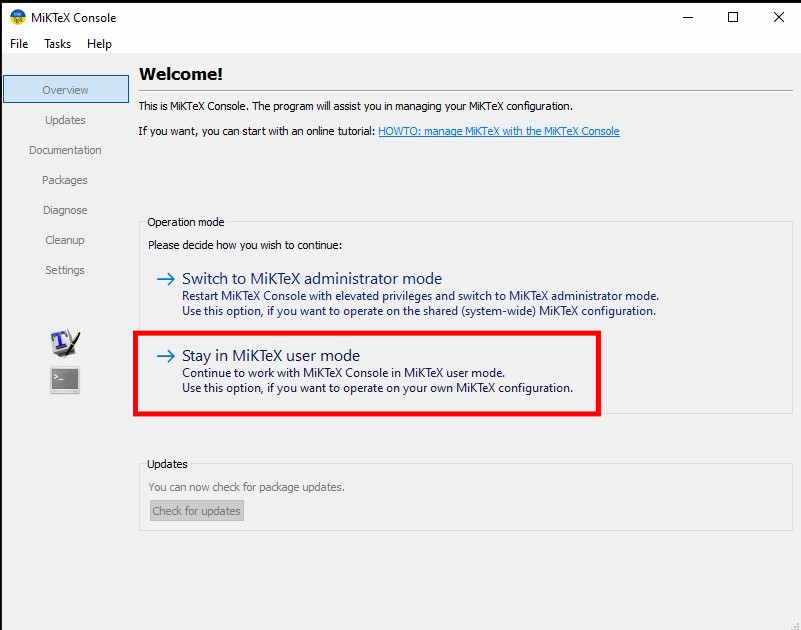
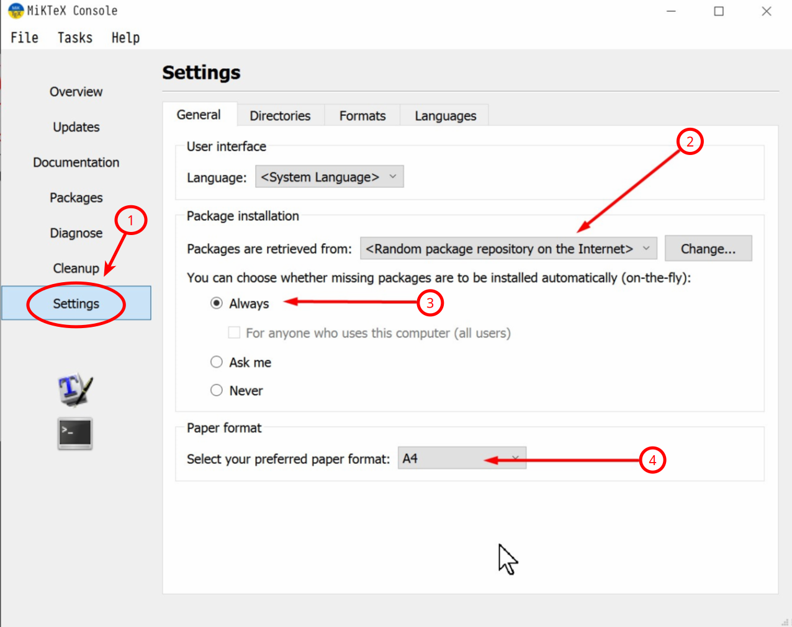

# MikTex Console Configuration

## Update MiKTeX

First of all, update MiKTeX by running this command in your terminal:

```
    miktex packages update
```

!!! Note "Important!"
    This command must be run at least twice (continue until you see no packages updated anymore)

## Configuration



!!! warning "MiKTeX is to be installed in **User mode** (not *Admin mode*)"
    *Admin Mode* leads to package load errors and a mix-up when users are not logged in as Administrators and the flag on “Always” is not set correctly (which requires Admin privs when installing).



Select `Settings` and configure as per screenshot:


