# Enfocus PitStop Activation Process

*Tested on PitStop version 21.3.0*

Select the menu `Help` > `About Third-Party Plug-Ins` > `About Enfocus PitStop Pro`.

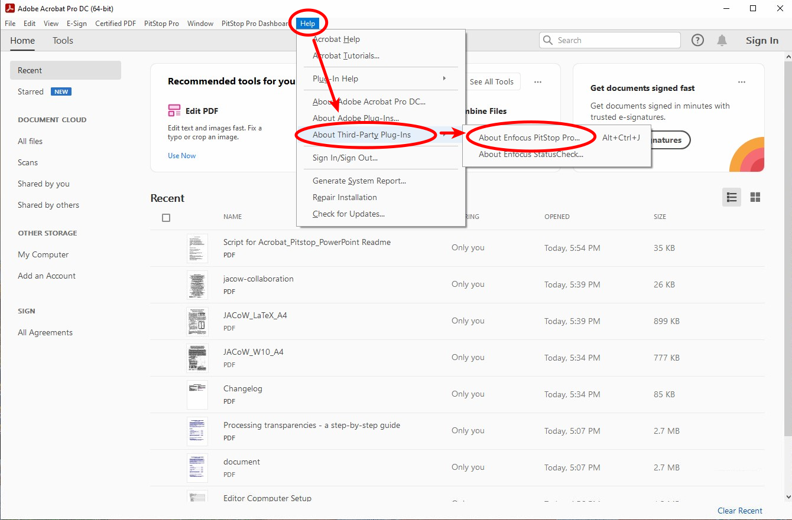

Select `Offline Activation`

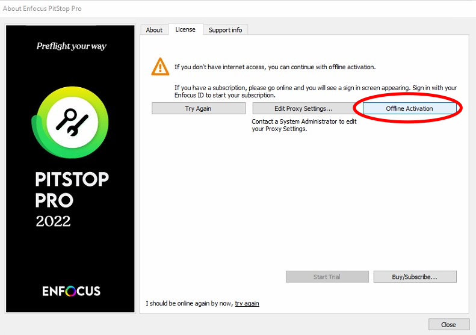

Click `Start Trial`.

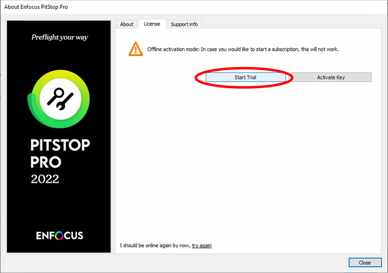

Enter your Enfocus ID then click `Start Trial`.

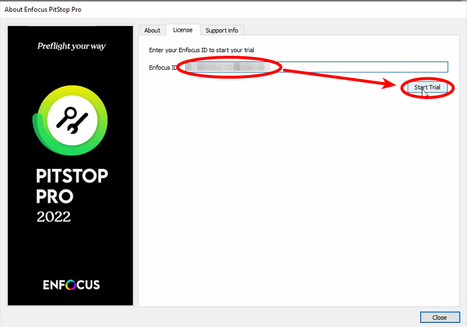

Save your Activation Request file to your computer.

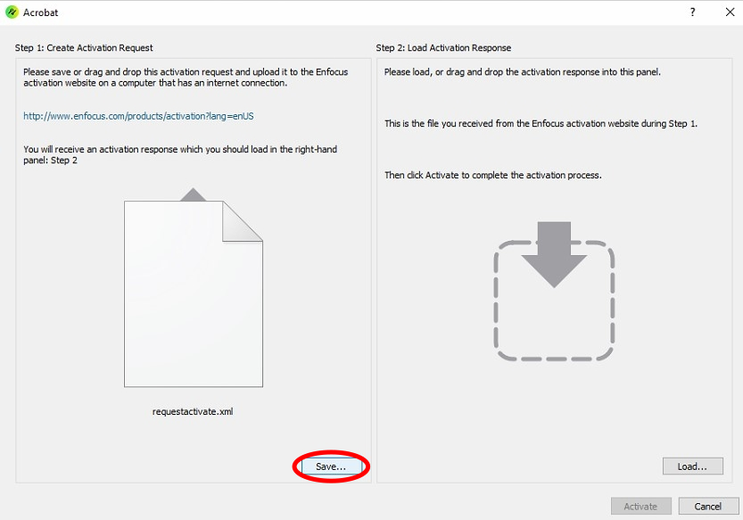

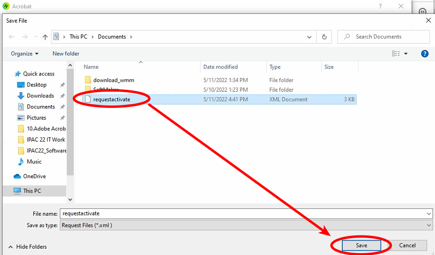Click the link to the offline activation Enfocus webpage. Then `Browse` to select the Activation Request file on your computer:

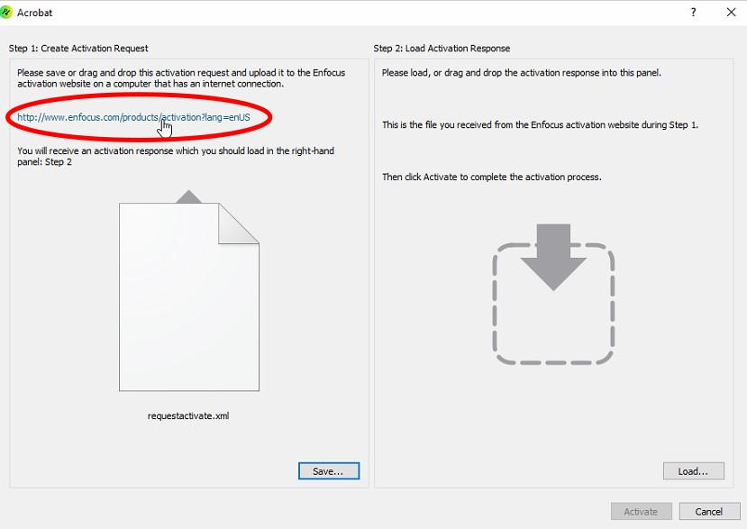

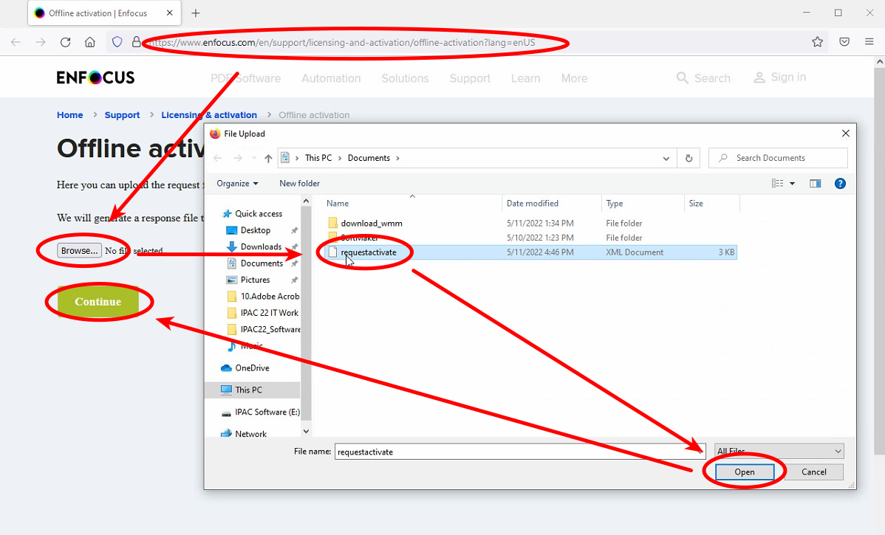

Enter your Enfocus ID (e-mail) and password:

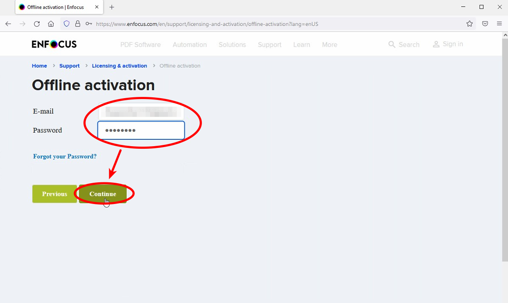

Then click `Continue` to finally activate PitStop.

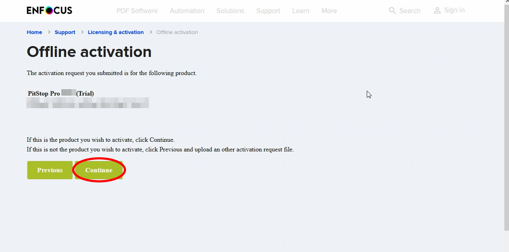

After having it activated, download the registration file:

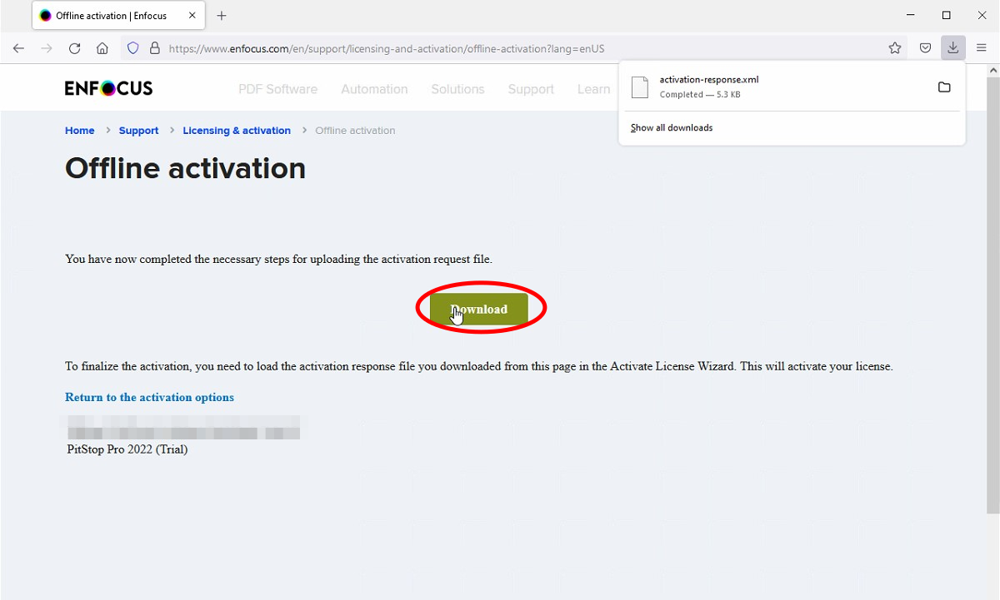

Then load the Activation Response file:

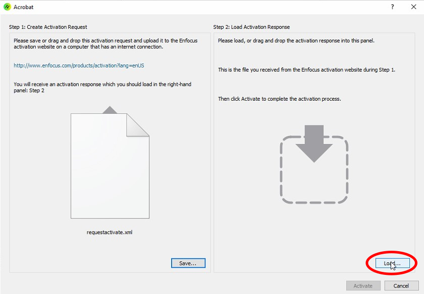

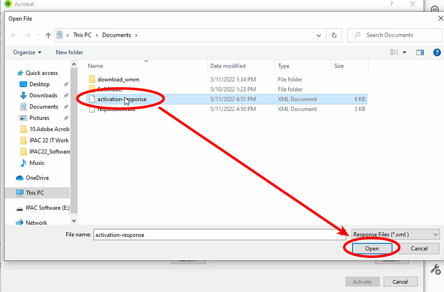

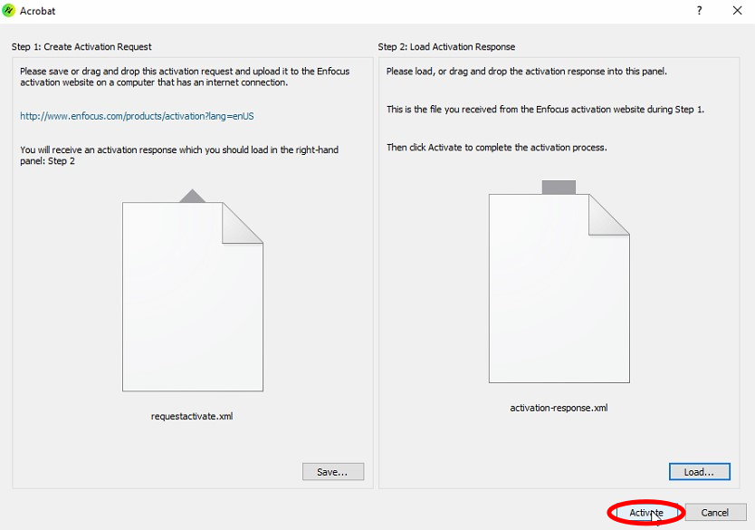

Now you can finally celebrate your success:

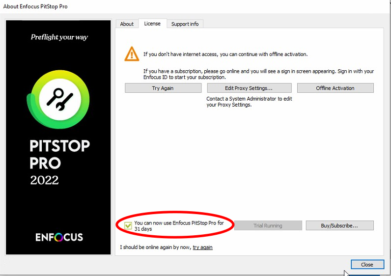
