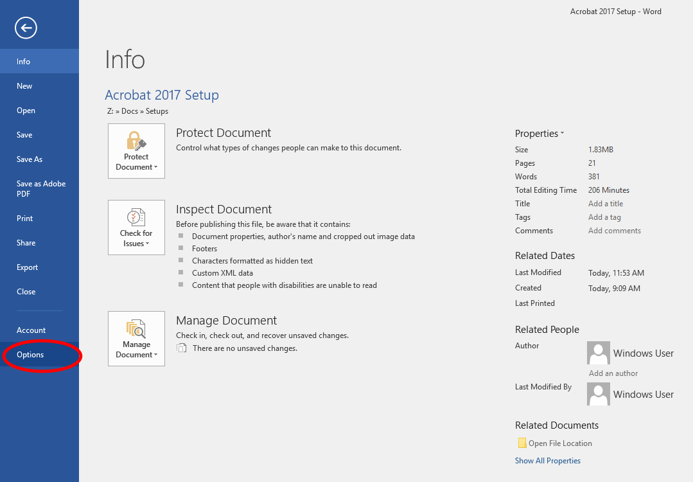
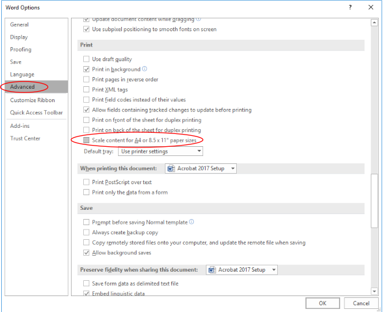
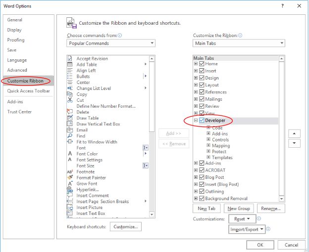
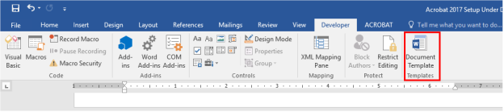
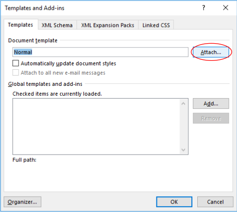
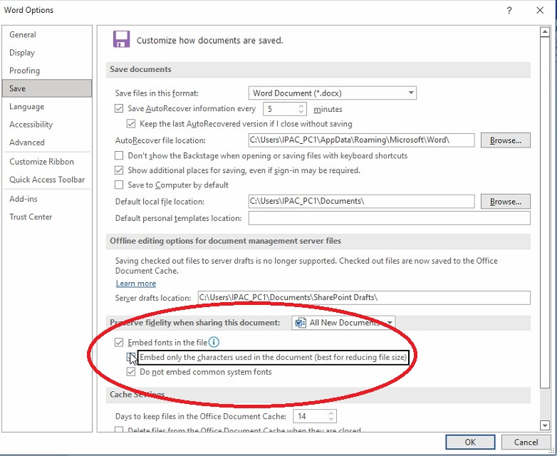
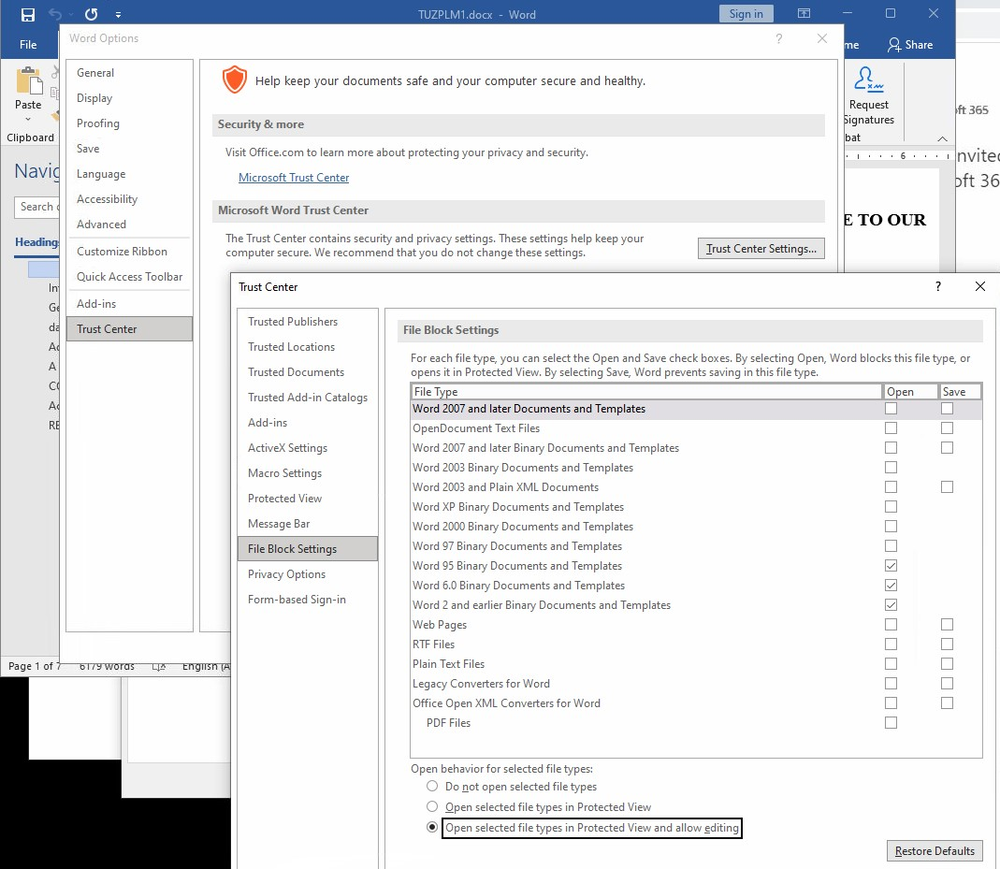

# Word 365 Configuration

## Enter the Word options

## Set some important options

After this the editor will be able to attach the JACoW template to a document created with another Word template:

and then select the most recent [JACoW Word template available](https://www.jacow.org/Authors/MSWord).

## Set fonts to be embedded

## Enable editing in Word by default

Access the menu  `File` > `Option` > `Trust Center` > `File Block Setting` to check `Open selected file types in Protected View and allow editing` then click `OK`:

