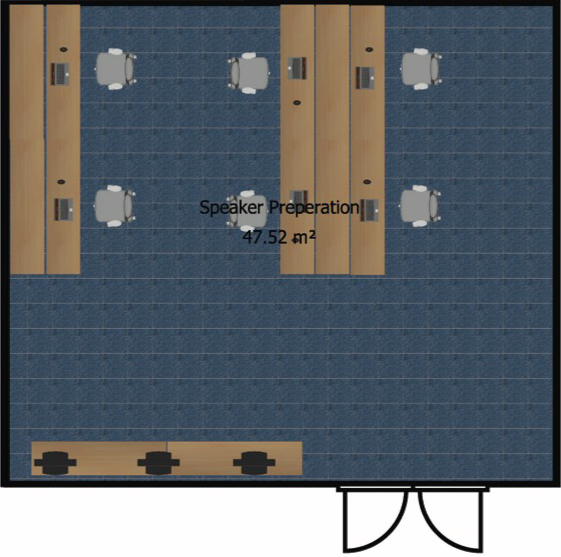

# Space Planning

Layouts can be created, for example, with Sweet Home 3D (free interior design application) and laid out to provide plenty of space for editors and ergonomic workspaces.

This way you will also catch early problematic setups with e.g. cabling or passage ways. And if you adjust the placed models properly you can even check if you have the correct amount of furniture ( for example amount of tables from the venue ).

The following example is from space planning for IPAC 12 and 15.

## Proceedings Office

			

## Speaker Preparation

	 	

## Author Reception

	 	

## All In One - IPAC 2012

