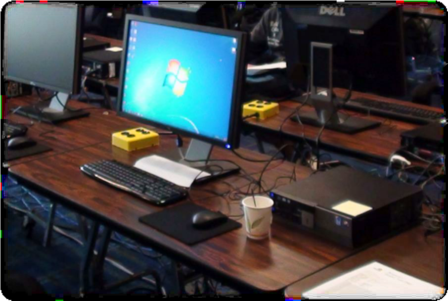
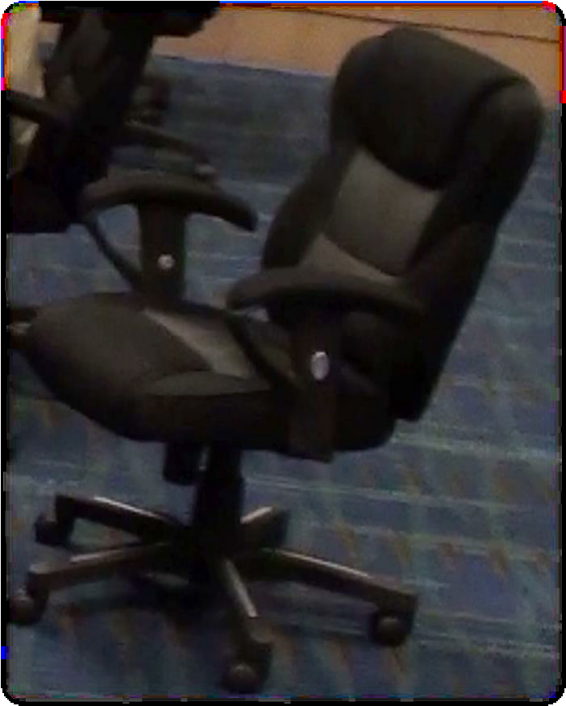
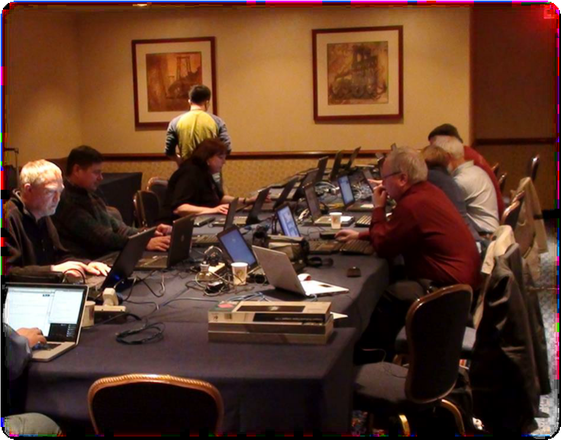

# Ergonomics

What we want to achieve is to minimize akward and overly static postures or strain. 

We are moving more a more to a paper less proceedings office process, but actually getting up and grabbing the printout after each paper, was not a bad exercise from an ergonomic point of view.

So, if people have to work though 10 days of editing, what we can try to do is to make the workplace comfortable.

## Workspaces

* Deep and wide enough to work with printed papers
* Enough Space for Laptops and to put other gear
* Extra chairs (and space) for visiting authors 

Good example:
 

Bad example:

     
## Chairs
        
* Ergonomic, height adjustable chairs
* With dynamic seating
* Comfortable for Editors to sit for 8-12 hours a day for up to 10 days 

Good example:

Bad example:
 
     
## Lighting

* Bright workspaces for reading papers
* Full spectrum lighting if possible
* Lots of natural light from windows if possible 

Good example:
 

Bad example:
 
     
     