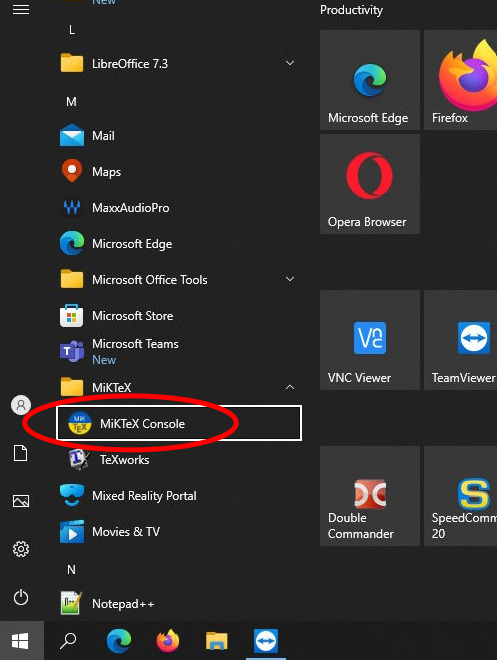
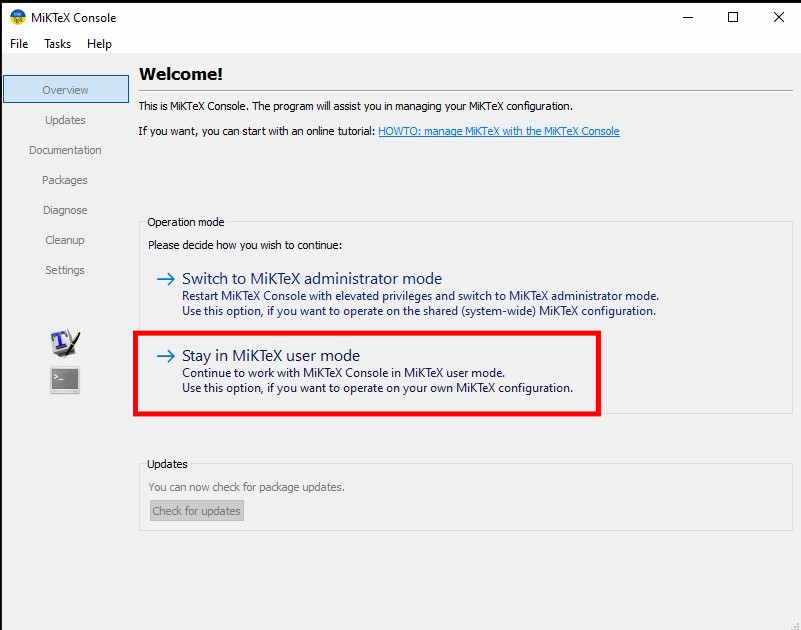

# MikTex Console Configuration

## Update MiKTeX

First of all, update MiKTeX by running this command in your terminal:

```
    miktex packages update
```

!!! Note "Important!"
    This command must be run at least twice (continue until you see no packages updated anymore)

## Configuration



!!! warning "MiKTeX is to be installed in **User mode** (not *Admin mode*)"
    *Admin Mode* leads to package load errors and a mix-up when users are not logged in as Administrators and the flag on “Always” is not set correctly (which requires Admin privs when installing).



Select `Settings` and configure as per screenshot:


## TeXstudio macros

TeXstudio is a cross-platform open-source TeX Editor. It has a built-in macro system that uses the `QuickJS` language. There are some interesting macros in the [official repository](https://github.com/texstudio-org/texstudio-macro) that can be installed by opening the Menu `Macros` ⇒ `Edit Macros...` ⇒ `Browse`. The scripts under `jacow` folder are specifically created for our events. Pull them and assign a shortcut to it.

Details on the macros can be found in the [IPAC-docs](https://ipac-docs.jacow.org/Paper/Writing/latex/#texstudio-tricks) manual.
