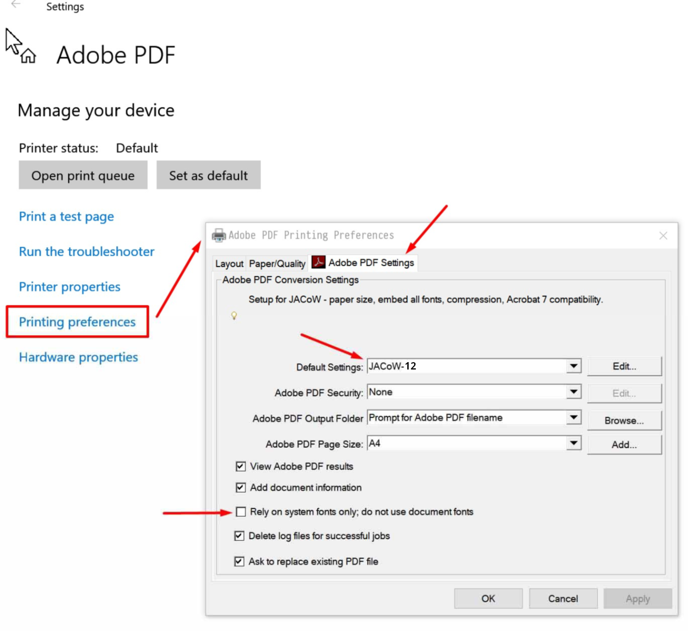

# Adobe PDF Printer Configuration

Access the Windows `Control Panel` > `All Control Panel Items` > `Devices and Printers` and Right click the `Adobe PDF` > `Printing Preference`.

Select the `JACoW-12` default setting...

... page size and other bits and pieces:

