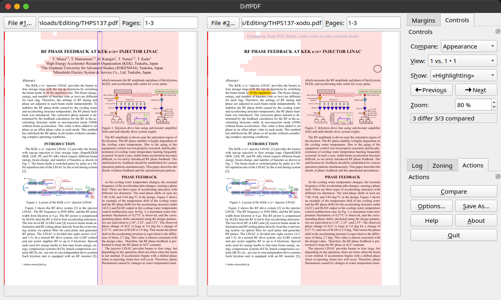

# PDF comparison tools

The Editor-in-Chief usually needs to iterate through **various versions of the final proceedings**. A **final quality check** is needed, task that normally needs to browse through all the papers and pages to spot any possible last-minute issue that could have been introduced by the editing process.
Re-doing this visual check for every new version of the proceedings is frustrating and time consuming. Using **automatic tools that analyse two PDFs** and highlight differences can speed up a lot this task. 
Acrobat Pro has a very useful function to Compare PDFs, which can also produce a report about the differences. This can be very useful for an editor, however it doesn't scale well with large documents like the final proceedings. It just can't handle those big documents.

Various other tools have been found and some of them tested and used. The following table enlists what can be used by a JACoW Editor-in-Chief, starting from the tools that proved to be more promising for our needs.

| Software                                                                                                           | Platform                  | License     | Cost (Italy)                                      | Notes                                                                                                                                                                                                                                                                                                                                                                                                                                                                                                                                                                                                                                                        | Tested           |
| ------------------------------------------------------------------------------------------------------------------ | ------------------------- | ----------- | ------------------------------------------------- | ------------------------------------------------------------------------------------------------------------------------------------------------------------------------------------------------------------------------------------------------------------------------------------------------------------------------------------------------------------------------------------------------------------------------------------------------------------------------------------------------------------------------------------------------------------------------------------------------------------------------------------------------------------ | ---------------- |
| **[DiffPDF](https://github.com/witwall/diffpdf)** Also [this](https://mark-summerfield.github.io/diffpdf.html) | Linux Windows          | GPL 2       | Free                                              | Works very well and fast. Tested on full IPAC'25 proceedings. Not updated since 2013, but still works.                                                                                                                                                                                                                                                                                                                                                                                                                                                                                                                                                    | Yes              |
| **[compare-pdf](https://github.com/Formartha/compare-pdf)**                                                        | Linux                     | MIT         | Free                                              | This utility compares PDF files visually by converting each page into images and then comparing them using OpenCV. It is particularly useful for identifying differences between PDF files that may not be apparent through text comparison alone.  Option `--showdiffs` is useful for visual comparison of differences, opens one window at a time for pages with differences. Very fast.                                                                                                                                                                                                                                                             | Yes              |
| **[diff-pdf](https://github.com/vslavik/diff-pdf)** [homepage](https://vslavik.github.io/diff-pdf/)            | Linux Windows MacOS | GPL         | Free                                              | CLI-based. Shows differences from two PDFs by over-stamping them and highlight changes with colours                                                                                                                                                                                                                                                                                                                                                                                                                                                                                                                                                       | Yes              |
| **[i‑net PDFC](https://www.inetsoftware.de/en/i-net-pdfc/)**                                                       | Linux Windows MacOS | Proprietary | 199 USD/year                                      | Looks professional and effective                                                                                                                                                                                                                                                                                                                                                                                                                                                                                                                                                                                                                             | Only online Demo |
| **[Acrobat Pro](https://www.adobe.com/acrobat/acrobat-pro.html)**                                                  | Windows MacOS          | Proprietary | 36,59 €/mo (monthly)  24,39 €/mo (annually) | Works well but **fails on large files** (e.g. IPAC'25 final proceedings)                                                                                                                                                                                                                                                                                                                                                                                                                                                                                                                                                                                     | Yes              |
| **[PDF-XChange Plus](https://www.pdf-xchange.com)**                                                                | Windows                   | Proprietary | 55.00 €                                           |                                                                                                                                                                                                                                                                                                                                                                                                                                                                                                                                                                                                                                                              | No               |
| **[Soda PDF Pro](https://www.sodapdf.com)**                                                                        | Windows                   | Proprietary | 15 €/mo (monthly)  7.50 €/mo (annually)     | You can compare two PDF files in two different ways. One option that you have is to use the _Compare Documents_ feature from the _Review Module_. This option is recommended because you can compare different versions of the same file, having highlights at every change. So, your files will open up next to each other showing all the differences between one and another.   Another option is to use the _Side By Side View_ feature from _View Module_ that allows you to simply open up two files next to each other. Here, the disadvantage here is that for this option are no markings to indicate changes or differences in the document. | No               |
| **[Draftable](https://www.draftable.com/)**                                                                        | Windows                   | Proprietary | $129 USD per user/year                            |                                                                                                                                                                                                                                                                                                                                                                                                                                                                                                                                                                                                                                                              |                  |
