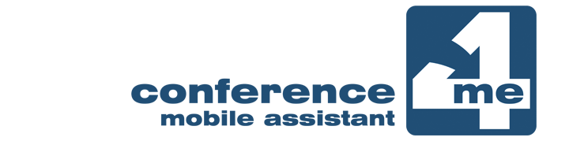

# Mobile app

In the past the conference programmes used to be printed and given to delegates in their conference bags. Now mobile phones are in everybody's pockets, hence having a mobile app is a natural evolution of the printed programmes.

They also can provide last-minute updates, push notifications, interaction via chat, etc.

Many JACoW conferences has successfully used [Conference4me](https://conference4me.psnc.pl/en/), a multi-platform mobile app created by Poznań Supercomputing and Networking Center, which can natively connect to Indico and dynamically fetch the data.

**Note**: some contribution details, like programme codes, are not fetched automatically. It is then recommended to buy the [Branded app](https://conference4me.psnc.pl/pricing/) and request a *Custom app modification* to include such additional data.

---

## Disclaimer

JACoW has no direct relationship with Poznań Supercomputing and Networking Center: every conference is responsible to choose the tool that suits best for their needs.
